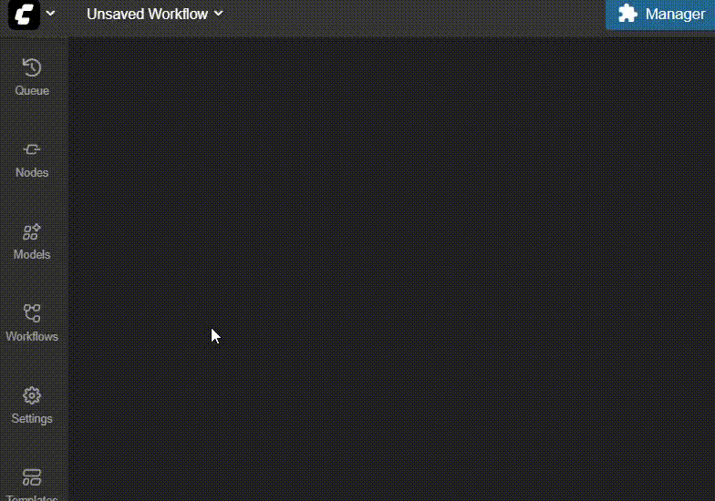

# ComfyUI Settings Sidebar Button

Adds a button to the sidebar to instantly open the Settings dialog panel. Saves you a click!

---

## Installation

1. Open **ComfyUI**
2. Go to **Manager > Custom Node Manager**
3. Search for `Settings Sidebar Button`
4. Click **Install**

## Settings

The extension provides the following settings (accessible via **Settings** in ComfyUI):

- **Enabled** (default: `true`)

  - Toggle the visibility of the settings button in the sidebar

- **Pin to Bottom** (default: `false`)

  - Pin the button to the bottom of the sidebar

- **Show Text** (default: `true`)
  - Show the text "Settings" on the button
